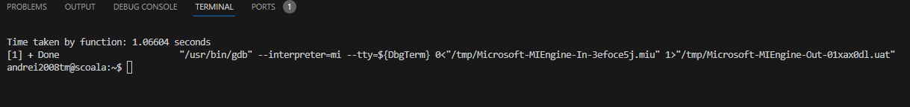
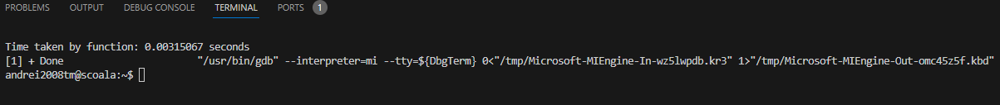

# Experiment-Sortarea elementelor

Acest experiment masoara timpul de sortare a 10000 de elemente.


## Tabelul cu valori

| elemente din fisier |    timp   |
|---------------------|-----------|
| elemente sortate    |  1.06604  |
| elemente nesortate  | 0.00315067|

## Functii folosite

Am folosit biblioteca chrono pentru masurarea timpului.
```cpp
auto start = chrono::high_resolution_clock::now();//momentul dinainte de inceperea sortarii
auto stop = chrono::high_resolution_clock::now();//momentul de dupa sortare
chrono::duration<double> duration = stop - start;//diferenta dintre cele 2 valori pentru obtinerea timpului in care se desfasoara sortarea
```

## Capturi de ecran



## Bibliografie

[Github Copilot](https://github.com/features/copilot/)   
[Measure execution time of a function in C++](https://www.geeksforgeeks.org/measure-execution-time-function-cpp/)  